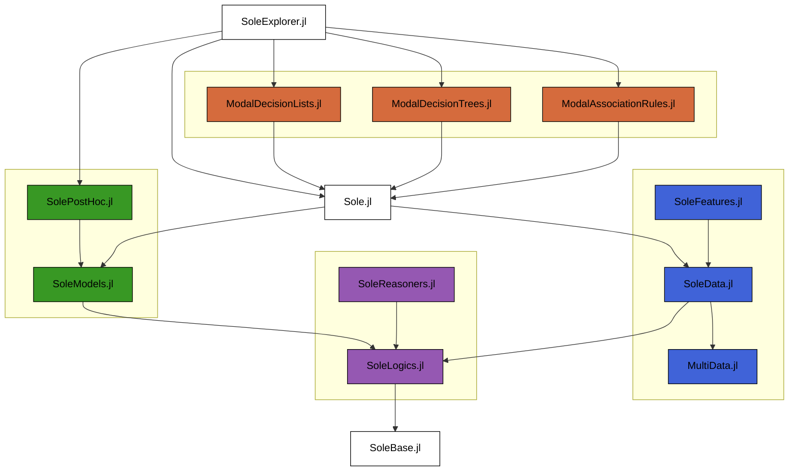

# Welcome to ACLAI Laboratory!

We are a research group within the Mathematics and Computer Science Department at the University of Ferrara, dedicated to advancing artificial intelligence through the integration of logic and AI. Our mission is to develop mathematically sound and formally certified AI tools.

## ☀️ Sole.jl – Our Core Framework

**[Sole.jl](https://github.com/aclai-lab/Sole.jl)** is an open-source framework written in **Julia** for symbolic learning. It provides a foundation for our research in AI by offering:

- 📊 **Efficient Data Representation** – Built-in support for structured and temporal data processing.
- 🏗 **Logical Model Learning** – Methods for extracting meaningful knowledge from raw data.
- 🔍 **Explainability & Transparency** – Designed with interpretability at its core.
- 🚀 **High Performance** – Leveraging Julia's speed for fast experimentation and deployment.
- 🔧 **Modular & Extensible** – Customizable tools for adapting to various AI research needs.

Sole.jl serves as the backbone for our AI research, powering various applications such as time-series analysis, medical data processing, and industrial predictive maintenance.

## 📂 Our Repositories

### 📜 Publication Repositories
These repositories contain datasets, experiments, and code related to our scientific publications:

- [LATD2025b](https://github.com/aclai-lab/LATD2025b)
- [LATD2025a](https://github.com/aclai-lab/LATD2025a)
- [BMC2025](https://github.com/aclai-lab/BMC2025)
- [ITADATA2024](https://github.com/aclai-lab/ITADATA2024)
- [OVERLAY2022](https://github.com/aclai-lab/OVERLAY2022.jl)

### 🧩 Fragments of Sole
Independent modules and extensions that enhance the functionality of **Sole.jl**:

[Sole.jl](https://github.com/aclai-lab/Sole.jl) core modules:
  - [SoleBase.jl](https://github.com/aclai-lab/SoleBase.jl)
  - [SoleLogics.jl](https://github.com/aclai-lab/SoleLogics.jl)
    - [SoleReasoners.jl](https://github.com/aclai-lab/SoleReasoners.jl)
  - [SoleModels.jl](https://github.com/aclai-lab/SoleModels.jl)
  - [SoleData.jl](https://github.com/aclai-lab/SoleData.jl)
    - [MultiData.jl](https://github.com/aclai-lab/MultiData.jl)

Sole.jl learning modules:
  - [ModalAssociationRules.jl](https://github.com/aclai-lab/ModalAssociationRules.jl)
  - [ModalDecisionTrees.jl](https://github.com/aclai-lab/ModalDecisionTrees.jl)
  - [ModalDecisionLists.jl](https://github.com/aclai-lab/ModalDecisionLists.jl)

Sole.jl user modules:
  - [SoleFeatures.jl](https://github.com/aclai-lab/SoleFeatures.jl)
  - [SoleXplorer.jl](https://github.com/aclai-lab/SoleXplorer.jl)
  - [SolePostHoc.jl](https://github.com/aclai-lab/SolePostHoc.jl)

Additional modules:
  - [Audio911.jl](https://github.com/aclai-lab/Audio911.jl)

For more details, visit our [official website](https://aclai.unife.it). 🚀
