# **ACLAI Laboratory**
### *Artificial Intelligence meets Mathematical Logic*

---

*"Where formal logic meets artificial intelligence to create transparent, mathematically sound, and certifiably reliable AI systems."*

## 🎯 Our Vision

We are pioneering the future of **explainable artificial intelligence** through the elegant fusion of mathematical logic and modern AI techniques. Based at the prestigious **University of Ferrara**, our research group is dedicated to developing AI systems that are not just powerful, but also transparent, interpretable, and formally verifiable.

In an era where AI decisions impact critical aspects of human life, we believe that understanding *why* an AI system makes a decision is as important as the decision itself.

## ⭐ Sole.jl — The Heart of Our Innovation

**[Sole.jl](https://github.com/aclai-lab/Sole.jl)** is our flagship open-source framework, written in the high-performance **Julia** language. It represents years of research distilled into a comprehensive toolkit for symbolic learning and explainable AI.

### 🌟 Why Sole.jl Stands Out

<table>
<tr>
<th align="center" width="50%">🧠 Intelligence & Logic</th>
<th align="center" width="50%">⚡ Performance & Flexibility</th>
</tr>
<tr>
<td align="center">
<strong>Advanced Symbolic Learning</strong> 
Logic-based knowledge extraction 
Temporal and structured data mastery 
Built-in explainability features 
Interpretable model architectures 
Formal verification capabilities
</td>
<td align="center">
<strong>High-Performance Computing</strong> 
Julia's lightning-fast execution 
Efficient memory management 
Scalable to enterprise workloads 
Modular ecosystem design 
Domain-agnostic architecture
</td>
</tr>
</table>

### 🚀 Real-World Impact

<table>
<tr>
<td align="center" width="25%">
<strong>🥠Healthcare</strong> 
Medical diagnosis support with explainable predictions
</td>
<td align="center" width="25%">
<strong>🭠Industry 4.0</strong> 
Predictive maintenance with transparent reasoning
</td>
<td align="center" width="25%">
<strong>🧠 Physiological Data Interpretation</strong> 
Real-time biosignal analysis with clinical-grade precision
</td>
<td align="center" width="25%">
<strong>🔬 Research</strong> 
Scientific discovery through pattern recognition
</td>
</tr>
</table>

---

## 🏗️ The Sole.jl Ecosystem

Our framework is built as a carefully orchestrated ecosystem of specialized modules, each designed to excel in its domain while contributing to the greater whole.

```mermaid
graph TD
    SX[<font color="black">🎨 SoleExplorer.jl</font>]

    subgraph "🤖 Learning Engines"
        MAR[<font color="black">📊 ModalAssociationRules.jl</font>]
        MDT[<font color="black">🌳 ModalDecisionTrees.jl</font>]
        MDL[<font color="black">📋 ModalDecisionLists.jl</font>]
    end
    
    S[<font color="black">⭐ Sole.jl<br/><i>Core Framework</i></font>]

    subgraph "📊 Data Intelligence"
        SF[🔧 SoleFeatures.jl]
        SD[💾 SoleData.jl]
        MD[🔗 MultiData.jl]
    end

    subgraph "🧠 AI Models"
        PHC[🔍 SolePostHoc.jl]
        SM[🎯 SoleModels.jl]
    end

    subgraph "🔬 Logic Foundation"
        SL[<font color="black">⚗️ SoleLogics.jl</font>]
        SR[🧮 SoleReasoners.jl]
    end
    
    SB[<font color="black">🏛️ SoleBase.jl<br/><i>Foundation</i></font>]

    SX --> MDL
    SX --> MDT
    SX --> MAR
    SX --> S
    SX --> PHC

    SL --> SB
    SD --> SL
    SD --> MD
    SM --> SL
    S --> SD
    PHC --> SM
    S --> SM
    SF --> SD
    MDL --> S
    MDT --> S
    MAR --> S
    SR --> SL

    style SX fill:#e1f5fe,stroke:#0277bd,stroke-width:2px
    style SB fill:#f3e5f5,stroke:#7b1fa2,stroke-width:2px
    style SL fill:#e8f5e8,stroke:#388e3c,stroke-width:2px
    style S fill:#fff8e1,stroke:#f57c00,stroke-width:3px
    style MDL fill:#ffebee,stroke:#d32f2f,stroke-width:2px
    style MDT fill:#ffebee,stroke:#d32f2f,stroke-width:2px
    style MAR fill:#ffebee,stroke:#d32f2f,stroke-width:2px
```

### 🎯 Core Modules

<table>
<tr>
<th align="center" colspan="2">🏛️ Foundation Layer</th>
</tr>
<tr>
<td align="center" width="33%">
<strong><a href="https://github.com/aclai-lab/SoleBase.jl">SoleBase.jl</a></strong> 
The bedrock of our ecosystem
</td>
<td align="center" width="33%">
<strong><a href="https://github.com/aclai-lab/SoleLogics.jl">SoleLogics.jl</a></strong> 
Advanced modal and temporal logic systems
</td>
</tr>
<tr>
<td align="center" colspan="2">
<strong><a href="https://github.com/aclai-lab/SoleReasoners.jl">SoleReasoners.jl</a></strong> 
Automated reasoning engines
</td>
</tr>
</table>

<table>
<tr>
<th align="center" colspan="3">🤖 Learning Engines</th>
</tr>
<tr>
<td align="center" width="33%">
<strong><a href="https://github.com/aclai-lab/ModalAssociationRules.jl">ModalAssociationRules.jl</a></strong> 
Pattern discovery in complex data
</td>
<td align="center" width="33%">
<strong><a href="https://github.com/aclai-lab/ModalDecisionTrees.jl">ModalDecisionTrees.jl</a></strong> 
Interpretable tree-based learning
</td>
<td align="center" width="33%">
<strong><a href="https://github.com/aclai-lab/ModalDecisionLists.jl">ModalDecisionLists.jl</a></strong> 
Sequential rule-based classification
</td>
</tr>
</table>

<table>
<tr>
<th align="center" colspan="3">📊 Data Intelligence</th>
</tr>
<tr>
<td align="center" width="33%">
<strong><a href="https://github.com/aclai-lab/SoleData.jl">SoleData.jl</a></strong> 
Intelligent data structures and processing
</td>
<td align="center" width="33%">
<strong><a href="https://github.com/aclai-lab/MultiData.jl">MultiData.jl</a></strong> 
Multi-modal data integration
</td>
<td align="center" width="33%">
<strong><a href="https://github.com/aclai-lab/SoleFeatures.jl">SoleFeatures.jl</a></strong> 
Advanced feature engineering
</td>
</tr>
</table>

<table>
<tr>
<th align="center" colspan="3">🎨 User Experience</th>
</tr>
<tr>
<td align="center" width="33%">
<strong><a href="https://github.com/aclai-lab/SoleModels.jl">SoleModels.jl</a></strong> 
Model management and deployment
</td>
<td align="center" width="33%">
<strong><a href="https://github.com/aclai-lab/SolePostHoc.jl">SolePostHoc.jl</a></strong> 
Post-hoc explainability tools
</td>
<td align="center" width="33%">
<strong><a href="https://github.com/aclai-lab/SoleXplorer.jl">SoleExplorer.jl</a></strong> 
Interactive model exploration
</td>
</tr>
</table>

<table>
<tr>
<th align="center">🔊 Specialized Applications</th>
</tr>
<tr>
<td align="center">
<strong><a href="https://github.com/aclai-lab/Audio911.jl">Audio911.jl</a></strong> 
Emergency audio analysis and classification
</td>
</tr>
</table>

---

## 📚 Research Impact & Publications

Our work bridges the gap between theoretical advances and practical applications, resulting in publications that shape the future of AI research.

### 🎓 Publications & Datasets

<table>
<tr>
<th align="center" width="40%">Research Domain</th>
<th align="center" width="60%">Publications & Datasets</th>
</tr>
<tr>
<td align="center"><strong>🧠 Logic & Temporal Data</strong></td>
<td align="center">
<a href="https://github.com/aclai-lab/LATD2025b">LATD2025b</a> • 
<a href="https://github.com/aclai-lab/LATD2025a">LATD2025a</a>
</td>
</tr>
<tr>
<td align="center"><strong>🏥 Biomedical Computing</strong></td>
<td align="center"><a href="https://github.com/aclai-lab/BMC2025">BMC2025</a></td>
</tr>
<tr>
<td align="center"><strong>📊 Data Science & AI</strong></td>
<td align="center"><a href="https://github.com/aclai-lab/ITADATA2024">ITADATA2024</a></td>
</tr>
<tr>
<td align="center"><strong>🔍 Explainable AI</strong></td>
<td align="center"><a href="https://github.com/aclai-lab/OVERLAY2022.jl">OVERLAY2022</a></td>
</tr>
</table>

Each repository contains comprehensive datasets, reproducible experiments, and detailed methodologies that contribute to the global AI research community.

---

## 🌟 Join Our Journey

### **Ready to shape the future of explainable AI?**

---

### 🤝 Collaborate With Us

<table>
<tr>
<th align="center" width="25%">🔬 Research</th>
<th align="center" width="25%">💻 Development</th>
<th align="center" width="25%">🏭 Industry</th>
<th align="center" width="25%">🎓 Academia</th>
</tr>
<tr>
<td align="center">
<strong>Research Collaboration</strong> 
Joint publications and grant applications
</td>
<td align="center">
<strong>Open Source Contribution</strong> 
Code contributions and feature development
</td>
<td align="center">
<strong>Industrial Partnership</strong> 
Real-world applications and consulting
</td>
<td align="center">
<strong>Academic Exchange</strong> 
Student projects and visiting researcher programs
</td>
</tr>
</table>

**Get in touch and let's build the future of AI together!**

---

*"In logic we trust, in mathematics we verify, in transparency we believe."*

**ACLAI Laboratory — University of Ferrara**

